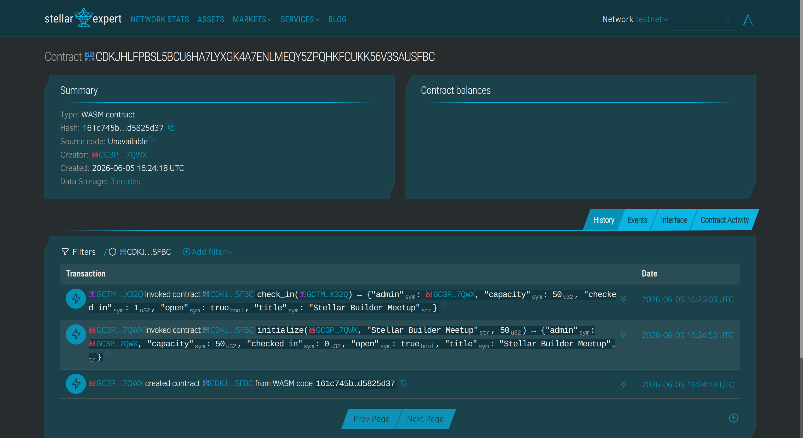

# EventStamp

## Description

EventStamp is a Stellar Soroban smart contract for on-chain event check-ins.

The project allows an organizer to create an event with a title and capacity. After the event is initialized, participants can check in using their own Stellar wallet. The contract stores the event state, the number of checked-in participants, and whether a specific participant has already checked in.

I built this project as a practical alternative to basic hello-world or counter contracts. It demonstrates persistent storage, wallet authentication, event state management, and successful interaction on Stellar Testnet.

## Project Vision

The vision of EventStamp is to make event attendance more transparent and verifiable on-chain. Instead of storing check-in data only in a centralized form or private database, EventStamp allows attendance records to be verified through a Stellar Soroban smart contract.

In the long term, this idea can support workshops, meetups, hackathons, classrooms, and community events. Organizers could use a frontend application to create events, let participants check in with a wallet, and later verify attendance history on-chain.

## Features

- Initialize an event with an organizer, title, and capacity.
- Allow participants to check in with wallet authentication.
- Store event data using Soroban persistent storage.
- Prevent the same participant from checking in twice.
- Track the total number of checked-in participants.
- Check whether a participant has already checked in.
- Retrieve current event information.
- Allow the organizer to close the event.

## Contract

Network: Stellar Testnet

Contract ID:

```text
CDKJHLFPBSL5BCU6HA7LYXGK4A7ENLMEQY5ZPQHKFCUKK56V3SAUSFBC
```

Contract link:

```text
https://stellar.expert/explorer/testnet/contract/CDKJHLFPBSL5BCU6HA7LYXGK4A7ENLMEQY5ZPQHKFCUKK56V3SAUSFBC
```

Deploy transaction:

```text
https://stellar.expert/explorer/testnet/tx/6ceaa9d6d161c83daeace0e96f32abd6f239e58b4009b931a0f7ec4d0830a6b9
```

Initialize transaction:

```text
https://stellar.expert/explorer/testnet/tx/94685f62a335401cf57c8728916ffe1a354149b3b2f33af40f8754d0e3ac06ab
```

Successful check-in transaction:

```text
https://stellar.expert/explorer/testnet/tx/6ae8c38397a08b593d457d64bc984698ca8a39083b6eb9fb7bf70d94a83153fb
```

Contract screenshot:



## Example Interaction

Organizer account:

```text
GC3PTBDO3HVLJ2SVSTHL2SDJTORGO7QLNLFFJUZW6N7TBXKG64D77QWX
```

Guest account:

```text
GCTMMU5RCHKDIY53V3PW5K5ELEEC27MCOQA524TG4ZER7YVOAGQBX32Q
```

Initialize the event:

```bash
stellar contract invoke --id CDKJHLFPBSL5BCU6HA7LYXGK4A7ENLMEQY5ZPQHKFCUKK56V3SAUSFBC --source-account organizer --network testnet -- initialize --admin GC3PTBDO3HVLJ2SVSTHL2SDJTORGO7QLNLFFJUZW6N7TBXKG64D77QWX --title "Stellar Builder Meetup" --capacity 50
```

Result:

```json
{"admin":"GC3PTBDO3HVLJ2SVSTHL2SDJTORGO7QLNLFFJUZW6N7TBXKG64D77QWX","capacity":50,"checked_in":0,"open":true,"title":"Stellar Builder Meetup"}
```

Check in as a guest:

```bash
stellar contract invoke --id CDKJHLFPBSL5BCU6HA7LYXGK4A7ENLMEQY5ZPQHKFCUKK56V3SAUSFBC --source-account guest --network testnet -- check_in --participant GCTMMU5RCHKDIY53V3PW5K5ELEEC27MCOQA524TG4ZER7YVOAGQBX32Q
```

Result:

```json
{"admin":"GC3PTBDO3HVLJ2SDJTORGO7QLNLFFJUZW6N7TBXKG64D77QWX","capacity":50,"checked_in":1,"open":true,"title":"Stellar Builder Meetup"}
```

Check whether the guest has checked in:

```bash
stellar contract invoke --id CDKJHLFPBSL5BCU6HA7LYXGK4A7ENLMEQY5ZPQHKFCUKK56V3SAUSFBC --source-account organizer --network testnet -- has_checked_in --participant GCTMMU5RCHKDIY53V3PW5K5ELEEC27MCOQA524TG4ZER7YVOAGQBX32Q
```

Result:

```text
true
```

Get event information:

```bash
stellar contract invoke --id CDKJHLFPBSL5BCU6HA7LYXGK4A7ENLMEQY5ZPQHKFCUKK56V3SAUSFBC --source-account organizer --network testnet -- get_event
```

Result:

```json
{"admin":"GC3PTBDO3HVLJ2SDJTORGO7QLNLFFJUZW6N7TBXKG64D77QWX","capacity":50,"checked_in":1,"open":true,"title":"Stellar Builder Meetup"}
```

## Future Scopes

In the future, EventStamp can be expanded into a more complete event attendance system. Possible improvements include supporting multiple events, storing event timestamps, adding event IDs, allowing multiple organizers, and generating attendance badges for participants.

Another possible direction is to build a frontend application where organizers can create events through a form and participants can check in by connecting their Stellar wallet.

## Profile

Name: Vo Lan Tuan

Skills:

- Rust smart contract development
- Stellar Soroban
- Blockchain basics
- Backend development
- AI and machine learning